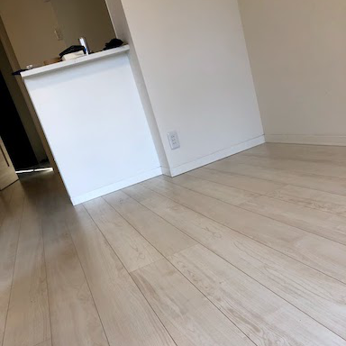
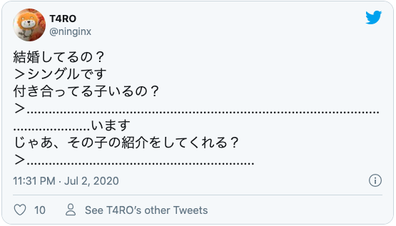
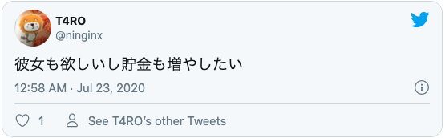
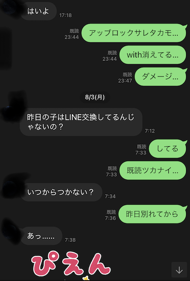
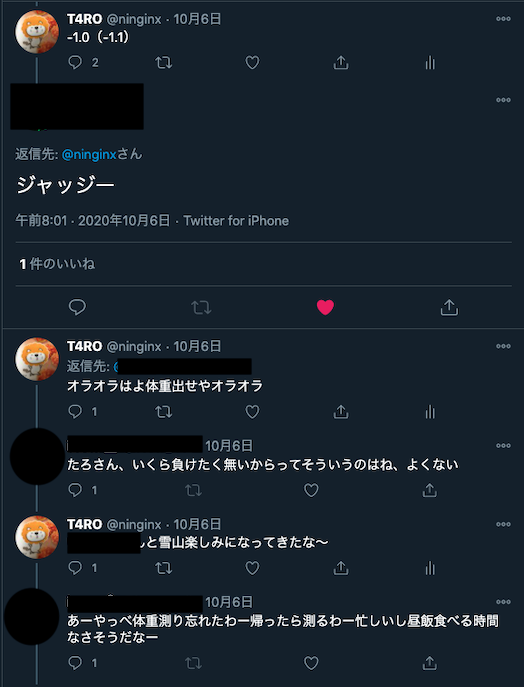
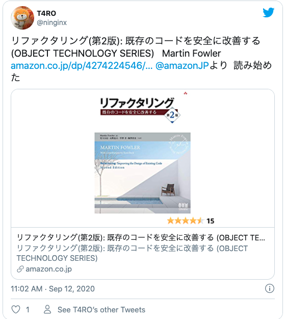
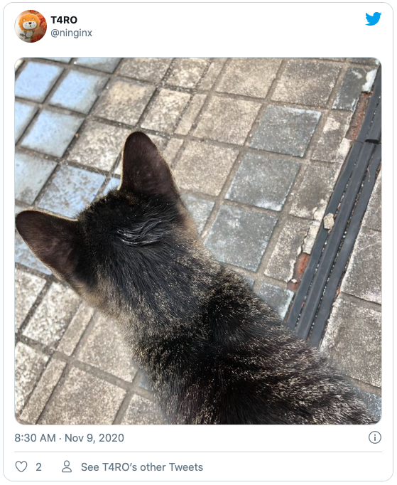
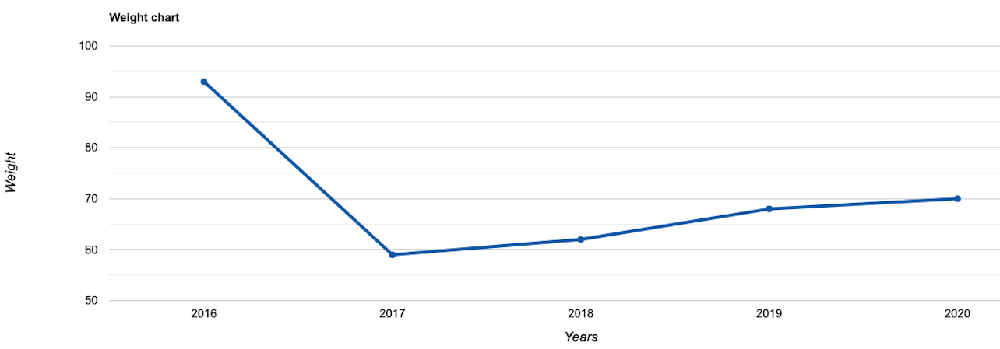

### はじめに
---------
2020年もあと少しですね。一年の振り返りにこの記事を書いています。
あの年はどんな年だったのか、何をしてたのか思い返す時のきっかけにしたい思っています。

### 期待をかけていた2020年
---------
2020年は、変化のある年にしようとしていた年でした。
新年の抱負からもやる気が感じられます。

結論から入ると、抱負はほとんど上手くいきませんでした。
途中から関心ごとが他のことに移っていったのが大きいです。
貯金は増えてるので、一つだけ達成ですね。

### ツイートをベースに振り返る
---------
今年のツイートをベースに掘り起こしていくことにしました。
人生は大体呟いているので。

*なんか後で消しちゃいそうなので、ツイートはスクショを貼り付けてます。

### 1月〜3月
---------
#### 社内ニート
2020年は社会人になってから、3度目に迎える年でした。
この頃は、グローバル案件の企画チームに所属していました。

残念ながら今年は世界的にコロナの感染が拡大し、一部の国ではロックダウンなどの対策を行っていました。
私が担当していた案件もコロナの影響をダイレクトに受けることになりました。

結果的に、仕事が減り椅子の前に座っているだけの時間が増え、ひたすら階段を昇ったり降りたりして定時を迎える努力をしていました。

茨城で感染者が出ていませんでしたが、関東圏で感染者数が増えていくのを昼休みのラジオで聞いていました。

※このツイートの直後に一人目の感染者が出ました。

##### 転職活動
仕事がないことも追い風になって、転職活動をしていました。
この時に職務経歴書を初めて作ったのですが、見栄えがそこそこよく少し誇らしかったのを覚えています。
結果的に、第二新卒枠で内定を頂き転職活動は2月上旬に終わりました。

内定後、退職したい旨を勤め先に伝えたのですが、当時の上司の表情や
その時の会話を思い出すと申し訳ない気持ちで一杯になります。
他にもっと良い伝え方がなかったのかなとふと後悔することがあります。

この時に、4月一杯で退職することも決まりました。

車を持っていたのですが、引越し先に駐車場もなく手放すことにしました。
決算期と被っていたこともあってか、買った時の値段から大きく減額することもなく買い取ってもらえました。
新年の抱負だった貯金を増やすはここで達成しました。通帳の残高が増えただけで、資産はあんまり変わってないですね。

#### 物件探し
転職先に近い場所で物件を探していました。まだコロナの影響もなくアパマンショップの店員さんと
「今年はオリンピックがあるのでどこも高くなってるんですよね」「そうなんですね」という会話をしたのを覚えています。

条件に見合う物件をいくつか見つけもらって、そのうちの一つと賃貸契約を結びました。

###　4月
---------
#### 退職
コロナ禍に加え、退職を控えていることもあって仕事はほとんどありませんでした。
最終出社日まで階段昇ったり降りたりして定時を迎えていました。この期間はほぼ記憶にないです。

#### ニート
退職して次の仕事か始まるまでの期間は、ほとんどの時間をでEscape From Tarkovに費やしました。
文字通り朝から晩までやってたと思います。コンビニに行く以外の用事で家を出ませんでした。

#### 引越し
社会人になってから、3度目の引越しでした。荷物を段ボールにつめたり、部屋の掃除をしたり、
要らないものを捨てたり引越しの準備は一日ほどで終わりました。

床の光沢から分かるように、入居した時と同じくらい床がピカピカにしました。

粗大ゴミを捨てるために軽トラを借りたおかげで、一年目の頃に気の迷いで買ったガラスのテーブルも処分することができました。

この時に、ソファーも一緒に処分したかったのですが、引越しのお兄さんに持っていかれてしまって処分に失敗しました。

処分される予定だったソファーです。

###### 引越しの様子
引越しのお兄さん「これも持って行きますか？」(ソファを指差して)

俺「え、アッ...ハイ」(ハイじゃない)

ちなみに、メルカリに出したら売れました。

部屋がめっちゃ広くなって、テンションが上がったのを覚えています。

#### 新居

GW入ってすぐだったと思いますが、この時初めて新居に入りました。
管理会社で鍵をもらって、その日のうちに引越し屋さんに荷物を運び込んでもらいました。

茨城に住んでた頃と比べると部屋は狭くなりましたが、
パソコンとベッドがあればいいような生活をしてるのであまり生活に変化はありませんでした。

###　5月~6月
---------
#### 睡眠の快適さを金で買う

ベッドの上に敷布団を直置きしていたのをマットレスに置き換えてから睡眠の質がめちゃくちゃ良くなりました。
腰痛も解消して、マットレスが届いた日を境にとても深い眠りにつけるようになりました。

2020年で買ったものの中でQoLの向上に一番貢献したものの一つだと思っています。

###　7月~8月
---------
#### 毎日英会話を始める

転職と共に英語を使う機会がめっきり減ったので、鍛え直そうと思ってDMM英会話を始めました。毎日30分、先生と英会話をして感想をツイートしてました。

<blockquote class="twitter-tweet">
    
英会話4日かいし

    &mdash; T4RO (@ninginx) <a href="https://twitter.com/ninginx/status/1280146949769814018?ref_src=twsrc%5Etfw">July 6, 2020</a>
</blockquote> 

DMM英会話の感想文ツイートです。

勉強になるのは、そうなんですが、知らない人と話すことが楽しかったです。
コロナが共通の話題になっていて、各国のコロナ事情も聞いたりしていました。

##### 英会話失敗談

つまらない見栄を張ったせいで、架空の彼女の紹介をするハメになりとても辛かったです。

#### マッチングアプリをはじめる

ツイート自体はあまりしませんでしたが、6月の中頃からマッチングアプリを始めました。
一番力を入れてやっていたのは、この時期だと思います。

彼女と仲良くしている友達を見て羨ましくなったことがきっかけだったと思います。

週に何人かマッチングして、半数は一通目のメッセージが返って来ず、
もう半数は1週間程度でメッセージが途切れるといった調子です。

その中にはやりとりを続けるうちに会ってもいいよと言ってくれる人もいて、ご飯を食べに行くことも何回かありました。

このツイートの事件の際も、人に会いに行く途中でした。俺じゃない...俺じゃなかったはず...

この時は喫茶店でお茶をして、次はどこどこ行きましょうみたいは話をしてお別れしたのを覚えています。

やっぱり臭ってたのか。

似たようなことが何回か続くうちに、辛くなってやめました。

マッチングアプリでうまくいっている友達の話を聞くと、そもそものマッチング数や会っている人の数に
だいぶ開きがあるようで、自分に合ったやり方を探した方が良さそうだなと感じました。

### 9月
--------
#### ダイエットレース

フォロワーとダイエットレースをしました。
1週間ごとに体重を何キロ落とせたか競い勝者は敗者に対して永遠に勝ち誇るみたいなルールで始めました。

3本先取だったのですが、接戦になり何度か引き分け、10月上旬まで勝負はもつれ込みました。

前日に水分を取らない強硬策に出てなんとか勝負を制しました。
対戦相手は勝敗に納得していませんでした。対ありです。

#### リファクタリングやTDDへの興味
コードを書く機会に恵まれているのですが、メンテナンス性の高いコードを書く技術が不足していて、勉強したいと思っていました。

友人に相談して何冊かおすすめを教えて貰い、リファクタリング本やTDD本を読むようになりました。年末にも勉強会を開いてくれて理解が深まりました。

TDDでバリバリ書けるようになりたいんですけど、テストコードを書くのが難しくて来年に残した課題になってます。。

### 10月
--------
#### 鬼滅の映画
今年一番楽しみにしていたイベントの一つです。

映画館でボロボロ泣きしました。

#### アップルウオッチ
今年買ったもので一番便利だったものの一つです。

スマホをなくしがちなのでコールできるのがめっちゃ便利です。あと、支払いにスマホ出さなくていいので楽。

#### 野良猫

### 11月
--------

### 香川でうどん食べてた

### 12月
--------

#### 応用情報処理技術者試験
普通に勉強不足でした。特に午後の文章問題が全然解けなかったです。
日本語が不自由になっているなと感じました。来年の春はちゃんと対策して臨みたいと思います。

 

#### TOEIC

社内TOEICを受けました。この時期に毎年受けてます。
リスニングは変わらなかったのですが、リーディングが100点くらい下がってました。

 
TOEICスコア

#### 体重

年々増えていってますね。来年は標準体重まで落としたいです。

体重

### まとめ
今年は上手くいかないことが多い年だったんだなぁと改めて実感しました。
やってみたらなんとかなるでしょ。なんだかんだ上手くいくんじゃないのみたいなことは全然なく、
自分にガッカリすることが多かったです。

今年は一つの関心ごとに興味を持ち続けることがあまりできませんでした。いろんな情報を拾い過ぎたのが良くなかったのかもしれません。

自分の関心ごとがどこにあるのか、5年先、10年先、20年先にどうありたいのか視えるようになっていたらいいなと思いました。

最後まで読んでいただきありがとうございました。

良いお年を！
