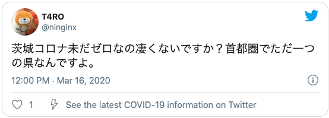
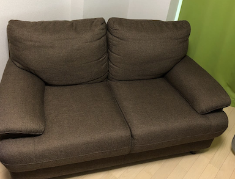

#### はじめに

2020年ももう終わりますね。私は昨日が仕事納めでした。そして、一年の振り返りとしてこの記事を書いています。
あの年はどんな年だったのか、何をしてたのか思い返そうとした時のきっかけにしたいという気持ちが最近になって強くなってきました。

今年に入ってからだと思いますが、去年や一昨年の出来事でも何年も前のことのように感じることが
何度かあって怖くなってしまったのがやる気としては大きいと思います。あと、記録を振り返るのが好きなので。

#### 期待をかけていた2020年とその結果

2020年は、変化のある年にしようと一念発起した年でした。
新年一発目の豊富からもやる気が感じられます。


結果だけ先に書くと、貯金を増やす以外は達成できませんでした。
裏抱負に彼女を作ろうって目標があったんですけどそれもダメでした。
彼女作ろうと頑張った話も中盤くらいでしようと思ってます。

#### twitterをベースに振り返る
今年のツイートをベースを掘り起こしていくことにしました。
人生は大体呟いているので。


### 1月〜3月
#### 社内ニート
2020年は社会人になって、3度目に迎える年でした。
この頃、私はグローバル案件の企画チームに所属していました。
海外支部がプロジェクトの主担当だったこともあり、
私のチームは比較的余裕をもって業務にあたることができたように思えます。

そして、2月には諸外国でコロナウィルスが
爆発的に感染拡大しロックダウンが発生していました。
リモートでたまに通話することはありましたが、
海外支部は仕事どころではなくなっていたように思えます。

結果的に、私は椅子の前に座っているだけになる時間が増えました。
この頃は、本当にやることがなく、階段を昇ったり降りたりして
定時を迎える努力をしていました。


茨城はまだ感染者数が0でしたが、関東圏で感染者数がどんどん増えていくのをニュースから知りました。



このツイートの直後に一人目の感染者が出ました。

##### 転職活動
仕事がないことも追い風になり、面接に行ったりしてました。
結果的に、ポテンシャル採用で内定を頂きました

内定が決まったすぐ後に、当時の勤先に退職したい旨を伝えました。
当時の上司の表情やその時の会話を思い出すと申し訳ない気持ちで一杯になります。
他にもっと良い伝え方がなかったのかなと今も夢に見ます。

相談した結果、4月一杯で退職が決まって少しずつ身辺整理を始めました。


茨城に住んでいて車を持っていたのですが、引越し先に駐車場もなく手放すことにしました。これは実家に帰省した時の写真です。

初めての車で愛着もありましたが、ガリバーで査定したその日に売りました。
決算期と被ってたこともあってか、買った時の値段から大きく減額することもなく買い取ってもらえました。
きれいに使っていて良かったです。

新年の抱負だった貯金を増やすはここで達成されています。通帳の残高が増えただけで、資産はあんまり変わってないですね。

#### 物件探し

3月に転職先に近い場所で物件を探していました。まだコロナの影響もなくアパマンショップの店員さんと
「今年はオリンピックがあるのでどこも高くなってるんですよね〜」「そうなんですね」という会話をしたのを覚えています。

なんだかんだ条件に見合う物件をいくつか見つけてくれて、その日のうちに契約も済ませました。

###　4月
#### 退職

退職日まで2週間ほど残して、最終出社日を迎えました。
もうすぐ退職することとコロナ禍なこともあって仕事はほとんどありませんでした。
最終出社日まで階段昇ったり降りたりしてたと思います。この期間はほぼ記憶にないです。

#### ニート
Escape From Tarkovをずっとやってました。文字通り朝から晩までやってたと思います。車売って出掛けられなかったのもありますが
コンビニに行く以外で家を出なかったです


#### 引越し

社会人になってから、3度目の引越しでした。荷物を段ボールにつめたり、雑巾掛けしてました。


ピカピカになった床です。


粗大ゴミを捨てるために、軽トラを借りたりしてました。
一年目の頃に気の迷いで買ったガラスのテーブルとかをここで処分することに成功しています。

ちなみに、本当はこの時、ソファーも一緒に処分する予定でしたが、引越しのお兄さんにソファを梱包されて新居に持っていかれてしまい処分に失敗しています。



処分される予定だったソファーです

###### 引越しの様子

引越しのお兄さん「これも持って行きますか？」(ソファを指差して)

俺「え、アッ...ハイ」(ハイじゃない)


ちなみに、7月に入ってからメルカリに出したら売れました。


部屋がめっちゃ広くなってテンションが上がったのを覚えています。

#### 新居

GW入って直後だったと思いますが、この時に初めて部屋に入りました。
管理会社で鍵をもらってそのまま直接行ったのを覚えています。


###　5月
なぜか記憶にないです。割愛。新しい仕事とか始まって色々あったと思うんですけど、なんでだろう...


You can also write code blocks here!

```js
const saltyDuckEgg = "chinese preserved food product"
```

| Number | Title                                    | Year |
| :----- | :--------------------------------------- | ---: |
| 1      | Harry Potter and the Philosopher’s Stone | 2001 |
| 2      | Harry Potter and the Chamber of Secrets  | 2002 |
| 3      | Harry Potter and the Prisoner of Azkaban | 2004 |

[View raw (TEST.md)](https://raw.github.com/adamschwartz/github-markdown-kitchen-sink/master/README.md)

This is a paragraph.

    This is a paragraph.

# Header 1

## Header 2

    Header 1
    ========

    Header 2
    --------

# Header 1

## Header 2

### Header 3

#### Header 4

##### Header 5

###### Header 6

    # Header 1
    ## Header 2
    ### Header 3
    #### Header 4
    ##### Header 5
    ###### Header 6

# Header 1

## Header 2

### Header 3

#### Header 4

##### Header 5

###### Header 6

    # Header 1 #
    ## Header 2 ##
    ### Header 3 ###
    #### Header 4 ####
    ##### Header 5 #####
    ###### Header 6 ######

> Lorem ipsum dolor sit amet, consectetuer adipiscing elit. Aliquam hendrerit mi posuere lectus. Vestibulum enim wisi, viverra nec, fringilla in, laoreet vitae, risus.

    > Lorem ipsum dolor sit amet, consectetuer adipiscing elit. Aliquam hendrerit mi posuere lectus. Vestibulum enim wisi, viverra nec, fringilla in, laoreet vitae, risus.

> ## This is a header.
>
> 1. This is the first list item.
> 2. This is the second list item.
>
> Here's some example code:
>
>     Markdown.generate();

    > ## This is a header.
    > 1. This is the first list item.
    > 2. This is the second list item.
    >
    > Here's some example code:
    >
    >     Markdown.generate();

- Red
- Green
- Blue

* Red
* Green
* Blue

- Red
- Green
- Blue

```markdown
- Red
- Green
- Blue

* Red
* Green
* Blue

- Red
- Green
- Blue
```

- `code goes` here in this line
- **bold** goes here

```markdown
- `code goes` here in this line
- **bold** goes here
```

1. Buy flour and salt
1. Mix together with water
1. Bake

```markdown
1. Buy flour and salt
1. Mix together with water
1. Bake
```

1. `code goes` here in this line
1. **bold** goes here

```markdown
1. `code goes` here in this line
1. **bold** goes here
```

Paragraph:

    Code

<!-- -->

    Paragraph:

        Code

---

---

---

---

---

    * * *

    ***

    *****

    - - -

    ---------------------------------------

This is [an example](http://example.com "Example") link.

[This link](http://example.com) has no title attr.

This is [an example][id] reference-style link.

[id]: http://example.com "Optional Title"

    This is [an example](http://example.com "Example") link.

    [This link](http://example.com) has no title attr.

    This is [an example] [id] reference-style link.

    [id]: http://example.com "Optional Title"

_single asterisks_

_single underscores_

**double asterisks**

**double underscores**

    *single asterisks*

    _single underscores_

    **double asterisks**

    __double underscores__

This paragraph has some `code` in it.

    This paragraph has some `code` in it.


    
