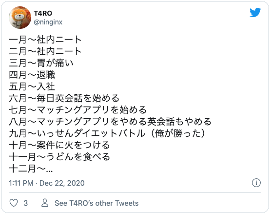

#### はじめに

2020年ももう終わりますね。私は昨日が仕事納めでした。そして、一年の振り返りとしてこの記事を書いています。
あの年はどんな年だったのか、何をしてたのか思い返そうとした時のきっかけにしたいという気持ちが最近になって強くなってきました。

今年に入ってからだと思いますが、去年や一昨年の出来事でも何年も前のことのように感じることが何度かあって怖くなってしまったのがやる気としては大きいと思います。
あと、単純に記録を振り返るのが好きなので... 

#### 期待をかけていた2020年とその結果

2020年は、変化のある年にしようと一念発起した年でした。新年一発目の豊富からもやる気が感じられます。


貯金を増やす以外は達成できませんでした。裏抱負に彼女を作ろうって目標があったんですけどそれもダメでした。
彼女作ろうと頑張った話も中盤くらいでしようと思ってます。次の項から記憶にある範囲で

#### 一年の振り返り
どう振り返りをしようかなと考えていてふと思いついたのが、twitterベースで掘り起こしていくことにしました。
人生は大体呟いているので。




#### 1月〜3月 社内ニートと転職


> A salted duck egg is a Chinese preserved food product made by soaking duck
> eggs in brine, or packing each egg in damp, salted charcoal. In Asian
> supermarkets, these eggs are sometimes sold covered in a thick layer of salted
> charcoal paste. The eggs may also be sold with the salted paste removed,
> wrapped in plastic, and vacuum packed. From the salt curing process, the
> salted duck eggs have a briny aroma, a gelatin-like egg white and a
> firm-textured, round yolk that is bright orange-red in color.


You can also write code blocks here!

```js
const saltyDuckEgg = "chinese preserved food product"
```

| Number | Title                                    | Year |
| :----- | :--------------------------------------- | ---: |
| 1      | Harry Potter and the Philosopher’s Stone | 2001 |
| 2      | Harry Potter and the Chamber of Secrets  | 2002 |
| 3      | Harry Potter and the Prisoner of Azkaban | 2004 |

[View raw (TEST.md)](https://raw.github.com/adamschwartz/github-markdown-kitchen-sink/master/README.md)

This is a paragraph.

    This is a paragraph.

# Header 1

## Header 2

    Header 1
    ========

    Header 2
    --------

# Header 1

## Header 2

### Header 3

#### Header 4

##### Header 5

###### Header 6

    # Header 1
    ## Header 2
    ### Header 3
    #### Header 4
    ##### Header 5
    ###### Header 6

# Header 1

## Header 2

### Header 3

#### Header 4

##### Header 5

###### Header 6

    # Header 1 #
    ## Header 2 ##
    ### Header 3 ###
    #### Header 4 ####
    ##### Header 5 #####
    ###### Header 6 ######

> Lorem ipsum dolor sit amet, consectetuer adipiscing elit. Aliquam hendrerit mi posuere lectus. Vestibulum enim wisi, viverra nec, fringilla in, laoreet vitae, risus.

    > Lorem ipsum dolor sit amet, consectetuer adipiscing elit. Aliquam hendrerit mi posuere lectus. Vestibulum enim wisi, viverra nec, fringilla in, laoreet vitae, risus.

> ## This is a header.
>
> 1. This is the first list item.
> 2. This is the second list item.
>
> Here's some example code:
>
>     Markdown.generate();

    > ## This is a header.
    > 1. This is the first list item.
    > 2. This is the second list item.
    >
    > Here's some example code:
    >
    >     Markdown.generate();

- Red
- Green
- Blue

* Red
* Green
* Blue

- Red
- Green
- Blue

```markdown
- Red
- Green
- Blue

* Red
* Green
* Blue

- Red
- Green
- Blue
```

- `code goes` here in this line
- **bold** goes here

```markdown
- `code goes` here in this line
- **bold** goes here
```

1. Buy flour and salt
1. Mix together with water
1. Bake

```markdown
1. Buy flour and salt
1. Mix together with water
1. Bake
```

1. `code goes` here in this line
1. **bold** goes here

```markdown
1. `code goes` here in this line
1. **bold** goes here
```

Paragraph:

    Code

<!-- -->

    Paragraph:

        Code

---

---

---

---

---

    * * *

    ***

    *****

    - - -

    ---------------------------------------

This is [an example](http://example.com "Example") link.

[This link](http://example.com) has no title attr.

This is [an example][id] reference-style link.

[id]: http://example.com "Optional Title"

    This is [an example](http://example.com "Example") link.

    [This link](http://example.com) has no title attr.

    This is [an example] [id] reference-style link.

    [id]: http://example.com "Optional Title"

_single asterisks_

_single underscores_

**double asterisks**

**double underscores**

    *single asterisks*

    _single underscores_

    **double asterisks**

    __double underscores__

This paragraph has some `code` in it.

    This paragraph has some `code` in it.


    
