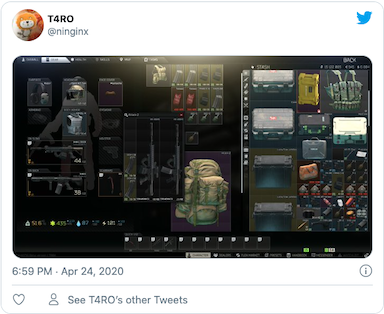
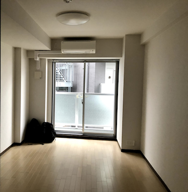
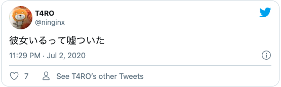
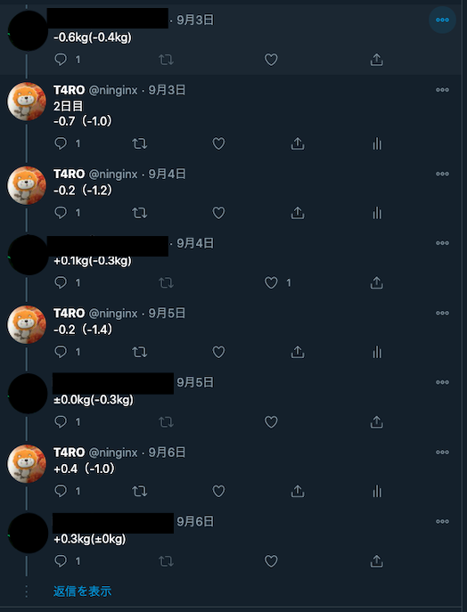
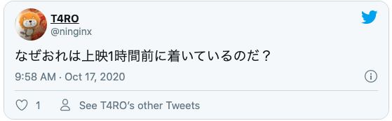
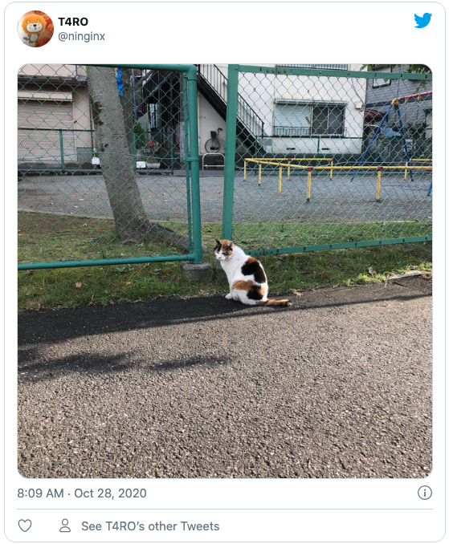
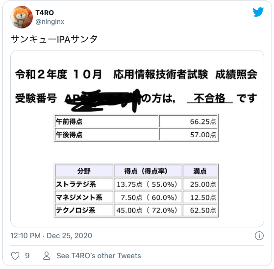

#### はじめに
---------
2020年ももう終わりますね。私は昨日が仕事納めでした。そして、一年の振り返りとしてこの記事を書いています。
あの年はどんな年だったのか、何をしてたのか思い返そうとした時のきっかけにしたいという気持ちが最近になって強くなってきました。

今年に入ってからだと思いますが、去年や一昨年の出来事でも何年も前のことのように感じることが
何度かあって怖くなってしまったのがやる気としては大きいと思います。あと、記録を振り返るのが好きなので。

#### 期待をかけていた2020年とその結果
---------
2020年は、変化のある年にしようと一念発起した年でした。
新年一発目の豊富からもやる気が感じられます。

結果だけ先に書くと、貯金を増やす以外は達成できませんでした。
裏抱負に彼女を作ろうって目標があったんですけどそれもダメでした。
彼女作ろうと頑張った話も中盤くらいでしようと思ってます。

#### twitterをベースに振り返る
---------
今年のツイートをベースを掘り起こしていくことにしました。
人生は大体呟いているので。

### 1月〜3月
---------
#### 社内ニート
2020年は社会人になって、3度目に迎える年でした。
この頃、私はグローバル案件の企画チームに所属していました。
海外支部がプロジェクトの主担当だったこともあり、
私のチームは比較的余裕をもって業務にあたることができたように思えます。

そして、2月には諸外国でコロナウィルスが
爆発的に感染拡大しロックダウンが発生していました。
リモートでたまに通話することはありましたが、
海外支部は仕事どころではなくなっていたように思えます。

結果的に、私は椅子の前に座っているだけになる時間が増えました。
この頃は、本当にやることがなく、階段を昇ったり降りたりして
定時を迎える努力をしていました。

茨城はまだ感染者数が0でしたが、関東圏で感染者数がどんどん増えていくのをニュースから知りました。

このツイートの直後に一人目の感染者が出ました。

##### 転職活動
仕事がないことも追い風になり、面接に行ったりしてました。
結果的に、ポテンシャル採用で内定を頂きました

内定が決まったすぐ後に、当時の勤先に退職したい旨を伝えました。
当時の上司の表情やその時の会話を思い出すと申し訳ない気持ちで一杯になります。
他にもっと良い伝え方がなかったのかなと今も夢に見ます。

相談した結果、4月一杯で退職が決まって少しずつ身辺整理を始めました。

茨城に住んでいて車を持っていたのですが、引越し先に駐車場もなく手放すことにしました。これは実家に帰省した時の写真です。

初めての車で愛着もありましたが、ガリバーで査定したその日に売りました。
決算期と被ってたこともあってか、買った時の値段から大きく減額することもなく買い取ってもらえました。
きれいに使っていて良かったです。

新年の抱負だった貯金を増やすはここで達成されています。通帳の残高が増えただけで、資産はあんまり変わってないですね。

#### 物件探し

3月に転職先に近い場所で物件を探していました。まだコロナの影響もなくアパマンショップの店員さんと
「今年はオリンピックがあるのでどこも高くなってるんですよね〜」「そうなんですね」という会話をしたのを覚えています。

なんだかんだ条件に見合う物件をいくつか見つけてくれて、その日のうちに契約も済ませました。

###　4月
---------
#### 退職

退職日まで2週間ほど残して、最終出社日を迎えました。
もうすぐ退職することとコロナ禍なこともあって仕事はほとんどありませんでした。
最終出社日まで階段昇ったり降りたりしてたと思います。この期間はほぼ記憶にないです。

#### ニート
Escape From Tarkovをずっとやってました。文字通り朝から晩までやってたと思います。車売って出掛けられなかったのもありますが
コンビニに行く以外で家を出なかったです

#### 引越し

社会人になってから、3度目の引越しでした。荷物を段ボールにつめたり、雑巾掛けしてました。

ピカピカになった床です。

粗大ゴミを捨てるために、軽トラを借りたりしてました。
一年目の頃に気の迷いで買ったガラスのテーブルとかをここで処分することに成功しています。

ちなみに、本当はこの時、ソファーも一緒に処分する予定でしたが、引越しのお兄さんにソファを梱包されて新居に持っていかれてしまい処分に失敗しています。

処分される予定だったソファーです

###### 引越しの様子

引越しのお兄さん「これも持って行きますか？」(ソファを指差して)

俺「え、アッ...ハイ」(ハイじゃない)

ちなみに、7月に入ってからメルカリに出したら売れました。

部屋がめっちゃ広くなってテンションが上がったのを覚えています。

#### 新居

GW入って直後だったと思いますが、この時に初めて部屋に入りました。
管理会社で鍵をもらって、その日のうちに引越し屋さんに荷物を運び込んでもらいました。

茨城に住んでた頃と比べると部屋は狭くなりましたが、
パソコンとベッドがあればいいような生活をしてるのであんまりQoLは変わりませんでした。

###　5月~6月
---------
#### 睡眠の快適さをを金で買う

ベッドの上に直に敷布団を置く謎運用をしてたんですが、マットレスを買ってから睡眠の質が爆上りしました。
腰痛も解消したし睡眠自体も深くなりました。

2020年で買ったものの中で一番QoLが上がったものだと思います。

###　7月~8月
---------
#### 毎日英会話を始める

仕事で英語を使う機会が減ったので、プライベートで英語力を鍛えようと思ってDMM英会話を始めました。毎日30分先生と英会話をして感想をツイートしてました。

<blockquote class="twitter-tweet">
    
英会話4日かいし

    &mdash; T4RO (@ninginx) <a href="https://twitter.com/ninginx/status/1280146949769814018?ref_src=twsrc%5Etfw">July 6, 2020</a>
</blockquote> 

DMM英会話の感想文ツイートの最初の方です。

勉強になるのは、もちろんそうなんですが、知らない人と話すことが普通に楽しかったです。
コロナが共通の話題になったので、各国のコロナ事情も知れたりしました。

つまらない見栄を張ったせいで、架空の彼女の紹介をするハメになりました。

#### マッチングアプリをはじめる

あんまりツイート自体はしませんでしたが、6月の中頃からマッチングアプリを始めました。
一番力を入れやってたのは、この時期だと思います。

彼女と仲良くしている友達を見て羨ましくなったことがきっかけだったと思います。

マッチングアプリに載せるための写真を撮ってもらったり、
プロフィールの文面を考えたりして準備万端で臨みました。

週に何人かマッチングしましたが、半数は一通目のメッセージが返って来ません。
もう半数は1週間程度でメッセージが途切れるといった調子で続けていました

その中にはやりとりを続けるうちに会ってもいいよと言ってくれる人もいて、ご飯を食べに行くこともありました。

この時も人に会いに行く途中でした。俺じゃない...俺じゃなかったはず...

銀座の駅前で待ち合わせして、喫茶店でお茶をしてました。
夕方ぐらいに次はどこどこ行きましょうみたいは話をしてお別れしました。

やっぱり臭ってたのか。

似たようなことが何回か続くうちに、辛くなってしまってやめてしまいました。

マッチングアプリでうまくいってる友達の話を聞くと、そもそものマッチング数や会っている人の数に
だいぶ開きがあるようで、自分に合ったやり方を探した方が良さそうだなと感じました。

### 9月
--------
#### ダイエットレース

フォロワーとダイエットレースをしました。
1週間ごとに体重を何キロ落とせたか競い合って勝者は敗者に対して永遠に勝ち誇ることができます。

3本先取だったのですが、接戦になり何度か引き分け10月中旬まで縺れ込みました。

前日に水分を極力取らないようにし、なんとか勝負を制しました。

#### リファクタリングやTDDへの興味
今年になってコードを書く機会に恵まれているのですが、
メンテナンス性の高いコードを書く技術が不足していました。

リファクタリング本やTDD本を手にとって読みようになりました。
ただ相変わらず綺麗なコードが書けているかというとまだまだです。

### 10月
--------
#### 鬼滅の映画
今年一番楽しみにしていたイベントの一つです。

オタク多くを語らず。映画館でボロボロ泣きました。

#### アップルウオッチ
今年買ったもので一番便利だったものの一つです。

スマホをなくしがちなのでコールできるのがめっちゃ便利です。あと、支払い系。

#### 野良猫

### 11月
--------

### 香川でうどん食べてた

### 12月
--------

#### 応用情報処理技術者試験
ファックユー。すいません。普通に勉強不足でした。
に応用情報の午後問題みたいな文章で回答する問題を全然解いてなくて書き方がわからなくなってました。
来年の春はちゃんと対策して臨みたいと思います。

 

#### TOEIC

社内TOEICを受けました。リスニング力は変わらなかったのですが、Readingが100点くらい下がってました。
こういうのは継続しないとすぐダメになりますね。

 
TOEICスコア

#### 体重

年々増えていってますね。そろそろ歯止めをかけないとあの頃にすぐ戻っちゃいそうですね。

体重

### まとめ
正直に言うと、今年はあんまりいい年じゃなかった。世界的にも俺個人としても、

